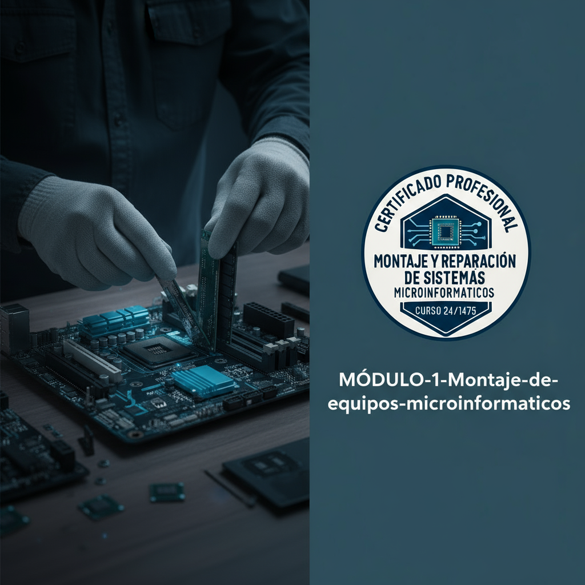

# 📚 Repositorio de Formación Certificación Profesional 24/1457 💻

> 🌟 Este repositorio contiene el material completo para los módulos de montaje, instalación y reparación de equipos microinformáticos.  
> 📂 Organizado por módulos, capítulos y prácticas detalladas.

---

---

## 🗂️ Estructura del Proyecto

* **MÓDULO-1-Montaje-de-equipos-microinformaticos**
    * **CAPITULO_1_COMPONENTES_DE_UN_EQUIPO_MICROINFORMATICO**

        * 1.1_CONECTORES
            * 1.1.1_Conectores_externos
            * 1.1.2_Conectores_internos
            * Media
            * Práctica
        * 1.2_LA_CAJA_O_CHASIS
            * 1.2.1_Material_de_las_cajas
            * 1.2.2_Formatos_mas_usuales
            * 1.2.3_Posibilidades_de_expansion
            * Media
        * 1.3_LA_PLACA_BASE
            * 1.3.1_Formatos_mas_usuales
            * 1.3.2_Formatos_mas_reducidos
            * 1.3.3_Elementos_de_la_placa_base
            * 1.3.4_El_socket_o_zocalo_de_la_CPU
            * Media
            * Práctica
        * 1.4_EL_CHIPSET
            * 1.4.1_El_Northbridge
            * 1.4.2_El_Southbridge
            * Media
            * Práctica
        * 1.5_LA_MEMORIA_RAM
            * 1.5.1_Parámetros_fundamentales_de_la_memoria
            * 1.5.2_Tipos_de_módulos_de_memoria
            * 1.5.3_Clasificación_de_las_memorias_RAM
            * 1.5.4_Memoria_Robson-actualizacion2025
            * Práctica
        * 1.6_LA_TARJETA_GRAFICA
            * 1.6.1_La_memoria_de_vídeo
            * 1.6.2_La_GPU
            * 1.6.3_Algunas_características_de_las_tarjetas_gráficas_actuales
            * Práctica
        * 1.7_EL_MICROPROCESADOR
            * 1.7.1_Disipación_del_calor
            * 1.7.2_Parámetros_de_un_microprocesador
            * 1.7.3_El_overclocking
            * 1.7.4_Fabricación_de_microprocesadores
            * 1.7.5_El_futuro_de_los_microprocesadores
            * Práctica
        * 1.8_LOS_BUSES
            * 1.8.1_Bus_PCI
            * 1.8.2_Bus_AGP
            * 1.8.3_Bus_PCI-Express
        * 1.9_TARJETAS_DE_EXPANSION
            * Práctica
        * 1.10_LA_FUENTE_DE_ALIMENTACION
            * 1.10.1_Qué_es_una_fuente_de_alimentación?
            * 1.10.2_Tipos_de_fuentes_de_alimentación
            * 1.10.3_Conectores_ATX_de_las_fuentes_de_alimentación
            * 1.10.4_Colores_de_los_cables_y_tensiones
            * Práctica
        * 1.11_EL_TRANSFORMADOR_DEL_PORTATIL
        * 1.12_DISPOSITIVOS_MAGNETICOS
            * 1.12.1_De_que_estan_compuestos_los_dispositivos_magneticos
            * 1.12.2_El_disco_duro
                * 1.12.2.1_ALGUNOS_ELEMENTOS_QUE_COMPONEN_UN_DISCO_DURO
                * 1.12.2.2_CONCEPTOS_PARA_REFERIRSE_A_ZONAS_DEL_DISCO
                * 1.12.2.3_TIPOS_DE_DIRECCIONAMIENTO
                * 1.12.2.4_CARACTERISTICAS_DE_UN_DISCO_DURO
                * 1.12.2.5_EL_INTERFAZ_DEL_DISCO_DURO
                * 1.12.2.6_APARCAMIENTO_DE_UN_DISCO
                * 1.12.2.7_VELOCIDAD_DE_ROTACION
                * 1.12.2.8_EL_TAMAÑO_FISICO
                * 1.12.2.9_TAMAÑO_DEL_BUFFER_O_CACHE
            * 1.12.3_Estructura_logica_de_un_disco
                * 1.12.3.1_LAS_PARTICIONES
                * 1.12.3.2_FORMATEO_A_BAJO_NIVEL_O_FORMATEO_FISICO
                * 1.12.3.3_FORMATEO_A_ALTO_NIVEL_O_FORMATEO_LOGICO
                * 1.12.3.4_LOS_SISTEMAS_DE_FICHEROS
                * 1.12.3.5_EL_SECTOR_DE_ARRANQUE
            * Práctica
        * 1.13_UNIDADES_DE_ESTADO_SOLIDO_O_SSD
            * Práctica
    * **CAPITULO_2_NORMATIVA_Y_RECOMENDACIONES_DE_SEGURIDAD**
        * 2.1_NORMAS_SOBRE_ERGONOMIA
        * 2.2_CONSEJOS_Y_NORMAS_SOBRE_MANIPULACION_Y_ALMACENAJE
            * 2.2.1_Proteccion_ambiental_Los_residuos_electronicos
            * 2.2.2_Normas_para_reducir_el_impacto_ambiental_de_la_informatica
            * 2.2.3_Reciclado_de_dispositivos_electronicos
        * 2.3_NORMAS_PARA_LA_PROTECCION_CONTRA_DESCARGAS_ELECTROSTATICAS
        * 2.4_PRECAUCIONES_Y_ADVERTENCIAS_DE_SEGURIDAD
            * 2.4.1_Previsiones_sobre_la_energia_electrica
            * 2.4.2_Previsiones_sobre_sistemas_de_refrigeracion_liquida
            * 2.4.3_Previsiones_sobre_los_componentes
            * 2.4.4_Previsiones_generales
        * Media
    * **CAPITULO_3_PROCEDIMIENTOS_PARA_EL_MONTAJE**
        * 3.1_EL_PUESTO_DE_MONTAJE
        * 3.2_PROCESO_DE_ARRANQUE_DE_UN_ORDENADOR
            * 3.2.1_Cuando_pulsamos_el_boton_de_encendido
            * 3.2.2_Cuando_carga_el_sistema_operativo
            * Práctica
        * 3.3_EL_PROCESO_DE_ENSAMBLADO
            * 3.3.1_Secuencia_de_montaje_de_un_ordenador
            * 3.3.2_Montaje_de_la_placa_base_en_la_caja_o_chasis
            * 3.3.3_Ensamblado_del_procesador_y_elementos_de_refrigeracion_del_mismo
            * 3.3.4_Fijacion_de_los_modulos_de_memoria_RAM
            * 3.3.5_Fijacion_y_conexion_de_las_unidades_de_disco_fijo
            * 3.3.6_Fijacion_y_conexion_del_resto_de_adaptadores_y_componentes
            * 3.3.7_Sistemas_de_refrigeracion_liquida
            * 3.3.8_Instalacion_de_elementos_de_modding
            * Práctica
        * Media
    * **CAPITULO_4_VERIFICACION_DE_EQUIPOS**
        * 4.1_FIN_DEL_MONTAJE_Y_VERIFICACION_DEL_EQUIPO
            * 4.1.1_Fin_de_la_instalacion._Revision_de_la_instalacion
            * 4.1.2_Inicio_del_equipo_por_primera_vez
            * 4.1.3_Tenemos_problemas
        * 4.2_CONFIGURACION_DE_LA_BIOS
            * 4.2.1_Que_es_la_BIOS
            * 4.2.2_Opciones_de_configuracion_de_la_BIOS
        * 4.3_PRUEBAS_CON_SISTEMAS_OPERATIVOS_EN_ALMACENAMIENTO_EXTRAIBLE
            * Práctica
        * 4.4_HERRAMIENTAS_DE_DIAGNOSTICO_Y_O_VERIFICACION
            * Práctica
    * **CAPITULO_5_MONTAJE_DE_PERIFERICOS**
        * 5.1_LA_CONTROLADORA_DE_LOS_PERIFERICOS
            * 5.1.1_El_driver
        * 5.2_CLASIFICACION_DE_PERIFERICOS
        * 5.3_INSTALACION_Y_MONTAJE_DE_PERIFERICOS
            * 5.3.1_Fijacion_y_conexion_de_las_unidades_opticas_de_lectura_escritura
            * 5.3.2_Instalacion_y_montaje_de_perifericos_externos_de_almacenamiento
            * 5.3.3_Instalacion_de_controladores_de_ventiladores_Fan_controller
            * 5.3.4_Instalacion_de_paneles_o_displays
