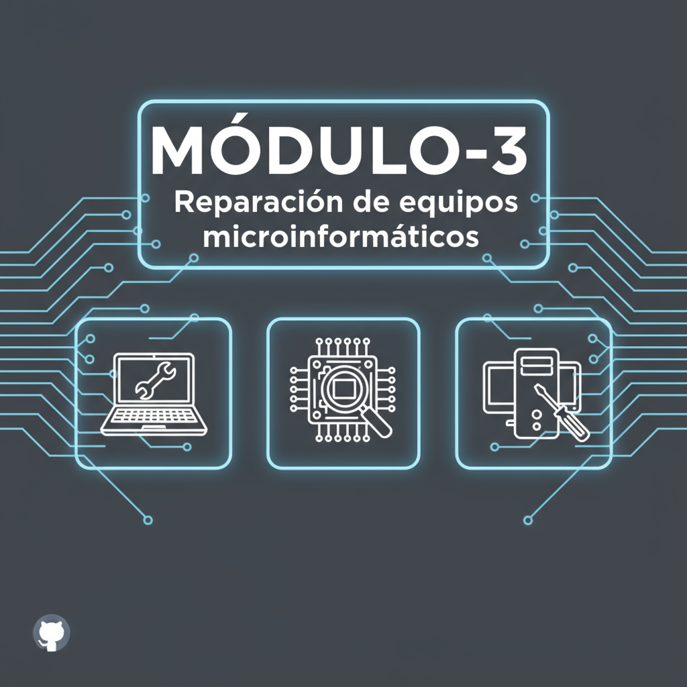

# 📚 Repositorio de Formación Certificación Profesional 24/1457 💻

> 🌟 Este repositorio contiene el material completo para los módulos de montaje, instalación y reparación de equipos microinformáticos.  
> 📂 Organizado por módulos, capítulos y prácticas detalladas.

---

├── 🔧 MÓDULO-3-Reparacion-de-equipos-microinformaticos
│   ├── ⚡ CAPITULO_1_ELECTRICIDAD_ELECTRONICA_APLICADA
│   │   ├── ⚡ 1.1_La_electricidad
│   │   │   └── 🔧 1.1.1_Conceptos_basicos_de_electricidad
│   │   ├── 🔌 1.2_La_electronica
│   │   │   └── 🔢 1.2.1_La_electronica_digital
│   │   └── 🛠️ 1.3_Utilizacion_de_instrumentacion_basica
│   │   ├── 📏 1.3.1_El_multimetro_o_polimetro
│   │   ├── 🔥 1.3.2_El_soldador
│   │   ├── 🔌 1.3.3_Tester_de_fuentes_de_alimentacion
│   │   └── 🧰 1.3.4_Otros_instrumentos_y_herramientas
│   ├── 🔧 CAPITULO_2_FUNCIONAMIENTO_DE_DISPOSITIVOS
│   │   ├── 🔌 2.1_Los_componentes_electronicos
│   │   │   ├── 🧱 2.1.1_Componentes_pasivos
│   │   │   └── 🔋 2.1.2_Componentes_activos
│   │   ├── 🔌 2.2_Dispositivos_que_proporcionan_energia_al_equipo
│   │   │   ├── 🔌 2.2.1_La_fuente_de_alimentacion
│   │   │   └── 🔌 2.2.2_El_transformador_del_portatil
│   │   ├── 🔋 2.3_Funcionamiento_del_sistema_de_carga_de_un_portatil
│   │   │   └── 🔋 2.3.1_El_ciclo_de_carga
│   │   └── 💾 2.4_Dispositivos_magneticos
│   │   ├── 🧲 2.4.1_De_que_estan_compuestos_los_dispositivos_magneticos
│   │   ├── 💿 2.4.2_El_disco_duro
│   │   └── 📂 2.4.3_Estructura_logica_de_un_disco
│   ├── ⚠️ CAPITULO_3_TIPOS_DE_AVERIAS
│   │   ├── 🔥 3.1_Factores_que_pueden_afectar_a_la_durabilidad_de_los_componentes
│   │   │   ├── 🔥 3.1.1_La_temperatura
│   │   │   ├── 🌫️ 3.1.2_Polvo_y_particulas
│   │   │   ├── 💧 3.1.3_Humedad_y_corrosion
│   │   │   ├── 🌀 3.1.4_Impactos_y_vibraciones
│   │   │   ├── ⚡ 3.1.5_Energia_electrostatica_descargas_electrostaticas
│   │   │   └── 🧲 3.1.6_Magnetismo
│   │   ├── 🛠️ 3.2_Causas_sintomas_y_soluciones_a_posibles_averias
│   │   ├── ❌ 3.3_Fallos_comunes_por_componentes
│   │   │   ├── 🔌 3.3.1_Fuente_de_alimentacion
│   │   │   ├── 🖳 3.3.2_Fallos_en_la_caja
│   │   │   ├── 🧠 3.3.3_Microprocesador
│   │   │   ├── 🖥️ 3.3.4_Placa_base
│   │   │   ├── 🧠 3.3.5_Memoria
│   │   │   ├── 🔌 3.3.6_Tarjetas_de_expansion
│   │   │   ├── 💿 3.3.7_Discos_duros
│   │   │   ├── 📀 3.3.8_Unidades_opticas
│   │   │   └── 🔌 3.3.9_Cables_de_datos
│   │   ├── 💻 3.4_Averias_en_ordenadores_portatiles
│   │   │   ├── 🔌 3.4.1_Fallos_en_la_alimentacion
│   │   │   ├── ⌨️ 3.4.2_Fallos_en_el_teclado
│   │   │   ├── 🧠 3.4.3_Memoria
│   │   │   ├── 📀 3.4.4_Unidades_opticas
│   │   │   ├── 💿 3.4.5_Disco_duro
│   │   │   ├── 🖥️ 3.4.6_Placa_base
│   │   │   └── 🖥️ 3.4.7_Fallos_en_la_pantalla
│   │   └── 🤔 3.5_Mitos_con_respecto_a_los_discos_duros
│   ├── 🔍 CAPITULO_4_DIAGNOSTICO_Y_LOCALIZACION_DE_AVERIAS
│   │   ├── 🛠️ 4.1_Procedimiento_de_localizacion_de_averias
│   │   ├── 💡 4.2_12_mas_1_consejos_practicos_al_encontrarse_con_una_averia
│   │   ├── 🔍 4.3_Deteccion_de_averias_en_un_equipo_informatico
│   │   │   ├── ✅ 4.3.1_Comprobaciones_al_montar_o_reparar_un_equipo_informatico
│   │   │   ├── 🔌 4.3.2_Inicio_de_la_computadora_por_primera_vez
│   │   │   └── ❌ 4.3.3_Problemas_en_la_instalacion_actualizacion_de_un_equipo
│   │   ├── 🔊 4.4_Senales_de_aviso_luminosas_y_acusticas
│   │   │   ├── 🔊 4.4.1_Senales_acusticas_de_la_BIOS
│   │   │   ├── 📺 4.4.2_Mensajes_de_error_de_la_BIOS_por_pantalla
│   │   │   └── 💡 4.4.3_Senales_luminosas_del_equipo
│   │   ├── 🛠️ 4.5_Software_de_diagnostico
│   │   │   ├── 🖥️ 4.5.1_Monitorizacion_de_la_placa_base
│   │   │   ├── 💿 4.5.2_SMART
│   │   │   ├── 📂 4.5.3_Utilidades_para_la_recuperacion_de_ficheros
│   │   │   ├── 💾 4.5.4_Utilidades_de_disco
│   │   │   └── 🛠️ 4.5.5_Utilidades_del_sistema
│   │   └── 🔌 4.6_El_conexionado_interno_y_externo_de_los_equipos_informaticos
│   │   ├── 🔌 4.6.1_Conectores_externos
│   │   └── 🔌 4.6.2_Conectores_internos
│   ├── 🔧 CAPITULO_5_LA_REPARACION_EN_EQUIPOS_INFORMATICOS
│   │   ├── 🪑 5.1_El_puesto_de_reparacion
│   │   ├── 💰 5.2_El_presupuesto_de_reparacion
│   │   ├── 💵 5.3_Criterios_de_tarificacion
│   │   │   ├── 🔧 5.3.1_Piezas_de_reparacion
│   │   │   └── 🧾 5.3.2_Factura
│   │   └── 🛠️ 5.4_El_procedimiento_de_reparacion
│   │   └── 🛡️ 5.4.1_Garantia_de_las_reparaciones
│   ├── 🦠 CAPITULO_6_VIRUS_Y_ANTIVIRUS
│   │   ├── 🦠 6.1_Tipos_de_malware
│   │   ├── ⚠️ 6.2_Como_actua_un_virus_informatico
│   │   ├── 🛡️ 6.3_Que_es_un_antivirus
│   │   ├── 🔐 6.4_Precauciones_para_evitar_una_infeccion
│   │   └── 🛠️ 6.5_Como_funciona_un_antivirus
│   │   ├── 🔍 6.5.1_Tecnica_de_scanning
│   │   ├── 🤖 6.5.2_Tecnicas_heuristicas
│   │   └── 🧹 6.5.3_Como_se_elimina_un_virus
│   ├── ➕ CAPITULO_7_AMPLIACION_DE_UN_EQUIPO
│   │   └── 🧩 7.1_Ampliaciones_de_hardware
│   │   ├── 🖥️ 7.1.1_Ampliaciones_tipicas_en_equipos_sobremesa_servidores_y_workstations
│   │   ├── 💻 7.1.2_Limitaciones_en_la_ampliacion_de_los_portatiles
│   │   └── 💻 7.1.3_Ampliaciones_en_portatiles
│   └── 🖨️ CAPITULO_8_REPARACION_DE_IMPRESORAS
│   ├── 🖨️ 8.1_La_impresora
│   │   └── 🖨️ 8.1.1_Tipos_de_impresoras
│   ├── 🖨️ 8.2_Las_multifuncionales
│   ├── 🏷️ 8.3_Marcas_y_modelos_mas_usuales
│   ├── ⚙️ 8.4_Funcionamiento_y_detalles_tecnicos
│   │   ├── 🔥 8.4.1_Funcionamiento_de_las_impresoras_termicas
│   │   └── 🖨️ 8.4.2_Funcionamiento_de_las_impresoras_laser
│   └── 🔍 8.5_Deteccion_y_solucion_de_problemas

---

## 🎯 Objetivos del Curso

Este curso está diseñado para:
- 🧰 Aprender a montar equipos informáticos desde cero.
- ⚙️ Instalar y configurar sistemas operativos modernos.
- 🔧 Diagnosticar y reparar averías comunes en hardware y software.
- 🛡️ Aplicar normas de seguridad y buenas prácticas en entornos técnicos.

---

## 📁 ¿Cómo usar este repositorio?

1. 📂 Navega por los módulos y capítulos.
2. 📄 Abre los archivos `.md` o `.pdf` en cada carpeta.
3. 🛠️ Realiza las prácticas incluidas.

---

## 📬 Contacto

¿Tienes dudas o sugerencias?  
📧  `ricardo.instructor.formacion@gmail.com`

---

