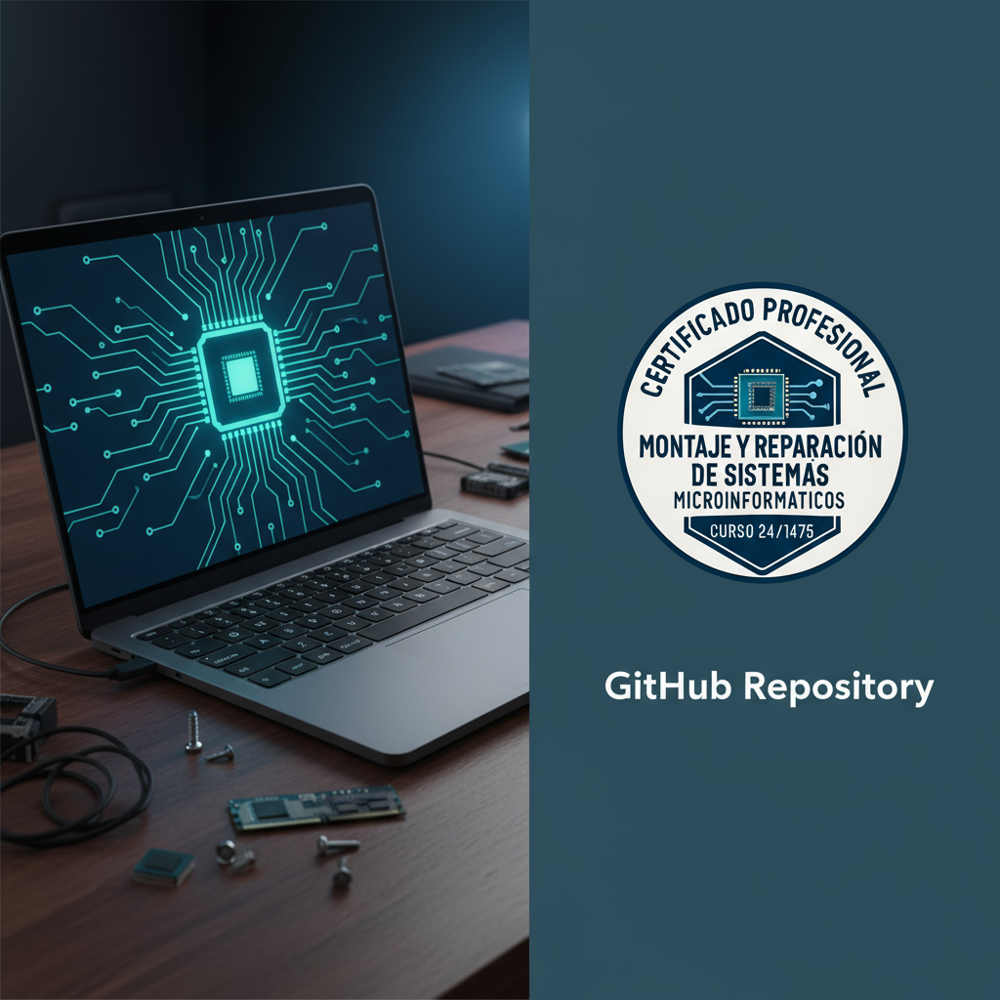

CAMBIO
# 📚 Repositorio de Formación Certificación Profesional 24/1457 💻

> 🌟 Este repositorio contiene el material completo para los módulos de montaje, instalación y reparación de equipos microinformáticos.  
> 📂 Organizado por módulos, capítulos y prácticas detalladas.

---

## 🗂️ Estructura del Proyecto

* **MÓDULO-1-Montaje-de-equipos-microinformaticos**
    * **CAPITULO_1_COMPONENTES_DE_UN_EQUIPO_MICROINFORMATICO**

        * 1.1_CONECTORES
            * 1.1.1_Conectores_externos
            * 1.1.2_Conectores_internos
            * 📹 Media
            * 🛠️ Práctica
        * 1.2_LA_CAJA_O_CHASIS
            * 1.2.1_Material_de_las_cajas
            * 1.2.2_Formatos_mas_usuales
            * 1.2.3_Posibilidades_de_expansion
            * 📹 Media
        * 1.3_LA_PLACA_BASE
            * 1.3.1_Formatos_mas_usuales
            * 1.3.2_Formatos_mas_reducidos
            * 1.3.3_Elementos_de_la_placa_base
            * 1.3.4_El_socket_o_zocalo_de_la_CPU
            * 📹 Media
            * 🛠️ Práctica
        * 1.4_EL_CHIPSET
            * 1.4.1_El_Northbridge
            * 1.4.2_El_Southbridge
            * 📹 Media
            * 🛠️ Práctica
        * 1.5_LA_MEMORIA_RAM
            * 1.5.1_Parámetros_fundamentales_de_la_memoria
            * 1.5.2_Tipos_de_módulos_de_memoria
            * 1.5.3_Clasificación_de_las_memorias_RAM
            * 1.5.4_Memoria_Robson-actualizacion2025
            * 🛠️ Práctica
        * 1.6_LA_TARJETA_GRAFICA
            * 1.6.1_La_memoria_de_vídeo
            * 1.6.2_La_GPU
            * 1.6.3_Algunas_características_de_las_tarjetas_gráficas_actuales
            * 🛠️ Práctica
        * 1.7_EL_MICROPROCESADOR
            * 1.7.1_Disipación_del_calor
            * 1.7.2_Parámetros_de_un_microprocesador
            * 1.7.3_El_overclocking
            * 1.7.4_Fabricación_de_microprocesadores
            * 1.7.5_El_futuro_de_los_microprocesadores
            * 🛠️ Práctica
        * 1.8_LOS_BUSES
            * 1.8.1_Bus_PCI
            * 1.8.2_Bus_AGP
            * 1.8.3_Bus_PCI-Express
        * 1.9_TARJETAS_DE_EXPANSION
            * 🛠️ Práctica
         * 1.10_LA_FUENTE_DE_ALIMENTACION
            * 1.10.1_Qué_es_una_fuente_de_alimentación?
            * 1.10.2_Tipos_de_fuentes_de_alimentación
            * 1.10.3_Conectores_ATX_de_las_fuentes_de_alimentación
            * 1.10.4_Colores_de_los_cables_y_tensiones
            * 🛠️ Práctica
        * 1.11_EL_TRANSFORMADOR_DEL_PORTATIL
        * 1.12_DISPOSITIVOS_MAGNETICOS
            * 1.12.1_De_que_estan_compuestos_los_dispositivos_magneticos
            * 1.12.2_El_disco_duro
                * 1.12.2.1_ALGUNOS_ELEMENTOS_QUE_COMPONEN_UN_DISCO_DURO
                * 1.12.2.2_CONCEPTOS_PARA_REFERIRSE_A_ZONAS_DEL_DISCO
                * 1.12.2.3_TIPOS_DE_DIRECCIONAMIENTO
                * 1.12.2.4_CARACTERISTICAS_DE_UN_DISCO_DURO
                * 1.12.2.5_EL_INTERFAZ_DEL_DISCO_DURO
                * 1.12.2.6_APARCAMIENTO_DE_UN_DISCO
                * 1.12.2.7_VELOCIDAD_DE_ROTACION
                * 1.12.2.8_EL_TAMAÑO_FISICO
                * 1.12.2.9_TAMAÑO_DEL_BUFFER_O_CACHE
            * 1.12.3_Estructura_logica_de_un_disco
                * 1.12.3.1_LAS_PARTICIONES
                * 1.12.3.2_FORMATEO_A_BAJO_NIVEL_O_FORMATEO_FISICO
                * 1.12.3.3_FORMATEO_A_ALTO_NIVEL_O_FORMATEO_LOGICO
                * 1.12.3.4_LOS_SISTEMAS_DE_FICHEROS
                * 1.12.3.5_EL_SECTOR_DE_ARRANQUE
            * 🛠️ Práctica
        * 1.13_UNIDADES_DE_ESTADO_SOLIDO_O_SSD
            * 🛠️ Práctica           
    * **CAPITULO_2_NORMATIVA_Y_RECOMENDACIONES_DE_SEGURIDAD**
        * 2.1_NORMAS_SOBRE_ERGONOMIA
        * 2.2_CONSEJOS_Y_NORMAS_SOBRE_MANIPULACION_Y_ALMACENAJE
            * 2.2.1_Proteccion_ambiental_Los_residuos_electronicos
            * 2.2.2_Normas_para_reducir_el_impacto_ambiental_de_la_informatica
            * 2.2.3_Reciclado_de_dispositivos_electronicos
        * 2.3_NORMAS_PARA_LA_PROTECCION_CONTRA_DESCARGAS_ELECTROSTATICAS
        * 2.4_PRECAUCIONES_Y_ADVERTENCIAS_DE_SEGURIDAD
            * 2.4.1_Previsiones_sobre_la_energia_electrica
            * 2.4.2_Previsiones_sobre_sistemas_de_refrigeracion_liquida
            * 2.4.3_Previsiones_sobre_los_componentes
            * 2.4.4_Previsiones_generales
        * 📹 Media
    * **CAPITULO_3_PROCEDIMIENTOS_PARA_EL_MONTAJE**
        * 3.1_EL_PUESTO_DE_MONTAJE
        * 3.2_PROCESO_DE_ARRANQUE_DE_UN_ORDENADOR
            * 3.2.1_Cuando_pulsamos_el_boton_de_encendido
            * 3.2.2_Cuando_carga_el_sistema_operativo
            * 🛠️ Práctica
        * 3.3_EL_PROCESO_DE_ENSAMBLADO
            * 3.3.1_Secuencia_de_montaje_de_un_ordenador
            * 3.3.2_Montaje_de_la_placa_base_en_la_caja_o_chasis
            * 3.3.3_Ensamblado_del_procesador_y_elementos_de_refrigeracion_del_mismo
            * 3.3.4_Fijacion_de_los_modulos_de_memoria_RAM
            * 3.3.5_Fijacion_y_conexion_de_las_unidades_de_disco_fijo
            * 3.3.6_Fijacion_y_conexion_del_resto_de_adaptadores_y_componentes
            * 3.3.7_Sistemas_de_refrigeracion_liquida
            * 3.3.8_Instalacion_de_elementos_de_modding
            * 🛠️ Práctica
        * 📹 Media
    * **CAPITULO_4_VERIFICACION_DE_EQUIPOS**
        * 4.1_FIN_DEL_MONTAJE_Y_VERIFICACION_DEL_EQUIPO
            * 4.1.1_Fin_de_la_instalacion._Revision_de_la_instalacion
            * 4.1.2_Inicio_del_equipo_por_primera_vez
            * 4.1.3_Tenemos_problemas
        * 4.2_CONFIGURACION_DE_LA_BIOS
            * 4.2.1_Que_es_la_BIOS
            * 4.2.2_Opciones_de_configuracion_de_la_BIOS
        * 4.3_PRUEBAS_CON_SISTEMAS_OPERATIVOS_EN_ALMACENAMIENTO_EXTRAIBLE
            * 🛠️ Práctica
        * 4.4_HERRAMIENTAS_DE_DIAGNOSTICO_Y_O_VERIFICACION
            * 🛠️ Práctica
    * **CAPITULO_5_MONTAJE_DE_PERIFERICOS**
        * 5.1_LA_CONTROLADORA_DE_LOS_PERIFERICOS
            * 5.1.1_El_driver
        * 5.2_CLASIFICACION_DE_PERIFERICOS
        * 5.3_INSTALACION_Y_MONTAJE_DE_PERIFERICOS
            * 5.3.1_Fijacion_y_conexion_de_las_unidades_opticas_de_lectura_escritura
            * 5.3.2_Instalacion_y_montaje_de_perifericos_externos_de_almacenamiento
            * 5.3.3_Instalacion_de_controladores_de_ventiladores_Fan_controller
            * 5.3.4_Instalacion_de_paneles_o_displays
        * 🛠️ Práctica
* **MÓDULO-2-Instalacion-y-configuracion-de-sistemas-operativos**
    * **CAPITULO_10_CONFIGURACION_DE_LAS_OPCIONES_DE_ACCESIBILIDAD**
        * 10.1_El_centro_de_accesibilidad
            * 10.1.1_Opciones_para_facilitar_la_visualizacion_de_la_pantalla
            * 10.1.2_Uso_de_narradores
            * 10.1.3_Opciones_para_hacer_mas_facil_el_uso_del_teclado_o_del_raton
            * 10.1.4_Uso_de_alternativas_visuales_y_de_texto_para_personas_con_dificultades_auditivas
        * 10.2_Reconocimiento_de_voz
    * **CAPITULO_11_CONFIGURACION_DEL_SISTEMA_INFORMATICO**
        * 11.1_Configuracion_del_entorno_de_trabajo
            * 11.1.1_Personalizacion_del_entorno_visual
        * 11.2_Cambiar_la_configuracion_regional_del_sistema
        * 11.3_Personalizacion_de_los_perifericos_basicos
            * 11.3.1_Como_agregar_una_impresora_local
            * 11.3.2_Como_configurar_las_propiedades_de_la_impresora
        * 11.4_Administrador_de_impresion
            * 11.4.1_Administrando_documentos_de_la_cola_de_impresion
    * **CAPITULO_1_ARQUITECTURAS_DE_UN_SISTEMA_MICROINFORMATICO**
        * 1.1_Esquema_funcional_de_un_ordenador
        * 1.2_La_unidad_central_de_procesamiento_y_sus_elementos
            * 1.2.1_La_memoria_interna
            * 1.2.2_La_memoria_de_video_o_grafica
        * 1.3_Las_unidades_de_entrada_y_salida
            * 1.3.1_Los_perifericos
        * 1.4_Las_unidades_de_almacenamiento_secundario
            * 1.4.1_Disco_duro
            * 1.4.2_Lector_grabador_de_discos_opticos_y_soportes_opticos
            * 1.4.3_Tarjetas_de_memoria_flash
        * 1.5_Las_tarjetas_de_expansion
            * 1.5.1_La_tarjeta_grafica
        * 1.6_Buses_y_ranuras_de_expansion
            * 1.6.1_Puertos_y_conectores
        * 1.7_Correspondencia_entre_subsistemas
    * **CAPITULO_2_FUNCIONES_DEL_SISTEMA_OPERATIVO**
        * 2.1_Conceptos_basicos
            * 2.1.1_Los_procesos
            * 2.1.2_Los_archivos
            * 2.1.3_Las_llamadas_al_sistema
            * 2.1.4_El_nucleo_del_sistema_operativo
            * 2.1.5_El_interprete_de_comandos
        * 2.2_Funciones_del_sistema_operativo
    * **CAPITULO_3_ELEMENTOS_DE_UN_SISTEMA_OPERATIVO**
        * 3.1_La_gestion_de_procesos
            * 3.1.1_La_planificacion_de_procesos
            * 3.1.2_Planificacion_de_CPU_multiprocesamiento
            * 3.1.3_Algoritmos_de_planificacion
            * 3.1.4_Sincronizacion_de_procesos
            * 3.1.5_Bloqueos
        * 3.2_La_gestion_de_la_memoria
            * 3.2.1_Fragmentacion
            * 3.2.2_Segmentacion
            * 3.2.3_Memoria_virtual
            * 3.2.4_Paginacion
            * 3.2.5_Algoritmos_de_reemplazo_de_paginas
        * 3.3_El_sistema_de_entrada_y_salida
            * 3.3.1_Acceso_directo_a_memoria
            * 3.3.2_Manejadores_de_dispositivos
        * 3.4_sistema_de_archivos
        * 3.5_sistema_de_proteccion
        * 3.6_sistema_de_comunicaciones
        * 3.7_sistema_interpretacion_ordenes
        * 3.8_Programas_de_sistema
    * **CAPITULO_4_SISTEMAS_OPERATIVOS_ACTUALES**
        * 4.1_Clasificacion_de_los_sistemas_operativos
            * 4.1.1_Por_los_servicios_ofrecidos
            * 4.1.2_Por_la_forma_de_ofrecer_los_servicios
            * 4.1.3_Por_su_disponibilidad
        * 4.2_Gestores_de_arranque
        * 4.3_Varios_SSSOO_ordenador
        * 4.4_Caracteristicas_de_los_sistemas_operativos
            * 4.4.1_Windows_8
            * 4.4.2_Windows_10
            * 4.4.3_Linux
    * **CAPITULO_5_INSTALACION_Y_CONFIGURACION_DE_SISTEMAS_OPERATIVOS**
        * 5.1_Requisitos_para_la_instalacion
            * 5.1.1_Windows_8
            * 5.1.2_Windows_10
            * 5.1.3_Ubuntu
        * 5.2_consideraciones_previas
        * 5.3_Tipos_de_instalación
        * 5.4_instalación_windows
        * 5.5_activacion_windows
        * 5.6_documentacion_instalacion
        * 🛠️ Prácticas
    * **CAPITULO_6_REPLICACION_FISICA_DE_PARTICIONES_Y_DISCOS_DUROS**
        * 6.1_copias_de_seguridad
        * 6.2_clonacion
        * 6.3_funcionalidad_de_la_replicacion
        * 6.4_Seguridad_y_prevencion_en_el_proceso_de_replicacion
            * 6.4.1_Recomendaciones_sobre_el_plan_de_contingencia
        * 6.5_Particiones_de_discos
            * 6.5.1_Tipos_de_particiones
            * 6.5.2_Herramientas_de_gestion
        * 6.6_Herramientas_de_creacion_e_implantacion_de_imagenes
            * 6.6.1_Como_realizar_una_copia_de_seguridad
            * 6.6.2_Como_crear_una_imagen_del_sistema
            * 6.6.3_Como_crear_un_disco_de_reparacion_del_sistema
            * 6.6.4_Como_crear_un_punto_de_restauracion_del_sistema
            * 6.6.5_Como_restaurar_una_copia_de_seguridad
        * 🛠️ Prácticas
    * **CAPITULO_7_ACTUALIZACION_DEL_SISTEMA_OPERATIVO**
        * 7.1_fuentes_de_actualización
        * 7.2_actualizaciones_automáticas
        * 7.3_centros de ayuda y soporte
        * 7.4_actualizacion_de_sistemas_operativos
        * 7.5_actualizacion_de_componentes_software
        * 7.6_Procedimientos_de_actualizacion
            * 7.6.1_Windows_Update
            * 7.6.2_La_instalacion_de_nuevos_programas
            * 7.6.3_La_desinstalacion_de_programas
            * 7.6.4_Instalacion_de_controladores
        * 7.7_Administrador_de_dispositivos
    * **CAPITULO_8_UTILIDADES_DEL_SISTEMA_OPERATIVO**
        * 8.1_Caracteristicas_y_funciones
            * 8.1.1_La_utilidad_Sistema
        * 8.2_Administracion_y_gestion_de_los_sistemas_de_archivos
            * 8.2.1_Como_crear_una_particion
            * 8.2.2_Como_aumentar_el_tamano_de_una_particion
            * 8.2.3_Como_disminuir_el_tamano_de_una_particion
            * 8.2.4_Liberar_espacio_en_disco
            * 8.2.5_Agilizar_el_acceso_a_los_datos
            * 8.2.6_Detectar_y_reparar_errores_de_disco
        * 8.3_Gestion_de_procesos_y_recursos
            * 8.3.1_El_administrador_de_tareas
            * 8.3.2_El_visor_de_eventos
            * 8.3.3_Como_administrar_los_servicios_de_un_equipo
            * 8.3.4_El_monitor_de_rendimiento
            * 8.3.5_El_registro_de_Windows
    * **CAPITULO_9_ORGANIZACION_DEL_DISCO_Y_SISTEMAS_DE_ARCHIVOS**
        * 9.1_El_sistema_de_archivos
        * 9.2_unidades_lógicas_de_almacenamiento
        * 9.3_Estructuracion_de_los_datos
            * 9.3.1_Los_directorios
            * 9.3.2_Los_archivos
            * 9.3.3_Tipos_de_archivos
        * 9.4_carpetas_y_archivos_del_sistema
        * 9.5_operaciones_comunes_con_archivos
        * 9.6_El_explorador_de_archivos
            * 9.6.1_Seleccionando_archivos_y_carpetas
            * 9.6.2_Crear_archivos_y_carpetas
            * 9.6.3_Eliminar_elementos_del_equipo
            * 9.6.4_Cambiar_el_nombre_de_un_elemento
            * 9.6.5_Copiar_y_mover_elementos
            * 9.6.6_Las_propiedades
            * 9.6.7_Ordenar_y_agrupar
            * 9.6.8_Opciones_de_carpeta
        * 9.7_busqueda_de_archivos
    * 🛠️ Practica
* **MÓDULO-3-Reparacion-de-equipos-microinformaticos**
    * **CAPITULO_1_ELECTRICIDAD_ELECTRONICA_APLICADA**
        * 1.1_La_electricidad
            * 1.1.1_Conceptos_basicos_de_electricidad
        * 1.2_La_electronica
            * 1.2.1_La_electronica_digital
        * 1.3_Utilizacion_de_instrumentacion_basica
            * 1.3.1_El_multimetro_o_polimetro
            * 1.3.2_El_soldador
            * 1.3.3_Tester_de_fuentes_de_alimentacion
            * 1.3.4_Otros_instrumentos_y_herramientas
    * **CAPITULO_2_FUNCIONAMIENTO_DE_DISPOSITIVOS**
        * 2.1_Los_componentes_electronicos
            * 2.1.1_Componentes_pasivos
            * 2.1.2_Componentes_activos
        * 2.2_Dispositivos_que_proporcionan_energia_al_equipo
            * 2.2.1_La_fuente_de_alimentacion
            * 2.2.2_El_transformador_del_portatil
        * 2.3_Funcionamiento_del_sistema_de_carga_de_un_portatil
            * 2.3.1_El_ciclo_de_carga
        * 2.4_Dispositivos_magneticos
            * 2.4.1_De_que_estan_compuestos_los_dispositivos_magneticos
            * 2.4.2_El_disco_duro
            * 2.4.3_Estructura_logica_de_un_disco
    * **CAPITULO_3_TIPOS_DE_AVERIAS**
        * 3.1_Factores_que_pueden_afectar_a_la_durabilidad_de_los_componentes
            * 3.1.1_La_temperatura
            * 3.1.2_Polvo_y_particulas
            * 3.1.3_Humedad_y_corrosion
            * 3.1.4_Impactos_y_vibraciones
            * 3.1.5_Energia_electrostatica_descargas_electrostaticas
            * 3.1.6_Magnetismo
        * 3.2_Causas_sintomas_y_soluciones_a_posibles_averias
        * 3.3_Fallos_comunes_por_componentes
            * 3.3.1_Fuente_de_alimentacion
            * 3.3.2_Fallos_en_la_caja
            * 3.3.3_Microprocesador
            * 3.3.4_Placa_base
            * 3.3.5_Memoria
            * 3.3.6_Tarjetas_de_expansion
            * 3.3.7_Discos_duros
            * 3.3.8_Unidades_opticas
            * 3.3.9_Cables_de_datos
        * 3.4_Averias_en_ordenadores_portatiles
            * 3.4.1_Fallos_en_la_alimentacion
            * 3.4.2_Fallos_en_el_teclado
            * 3.4.3_Memoria
            * 3.4.4_Unidades_opticas
            * 3.4.5_Disco_duro
            * 3.4.6_Placa_base
            * 3.4.7_Fallos_en_la_pantalla
        * 3.5_Mitos_con_respecto_a_los_discos_duros
    * **CAPITULO_4_DIAGNOSTICO_Y_LOCALIZACION_DE_AVERIAS**
        * 4.1_Procedimiento_de_localizacion_de_averias
        * 4.2_12_mas_1_consejos_practicos_al_encontrarse_con_una_averia
        * 4.3_Deteccion_de_averias_en_un_equipo_informatico
            * 4.3.1_Comprobaciones_al_montar_o_reparar_un_equipo_informatico
            * 4.3.2_Inicio_de_la_computadora_por_primera_vez
            * 4.3.3_Problemas_en_la_instalacion_actualizacion_de_un_equipo
        * 4.4_Senales_de_aviso_luminosas_y_acusticas
            * 4.4.1_Senales_acusticas_de_la_BIOS
            * 4.4.2_Mensajes_de_error_de_la_BIOS_por_pantalla
            * 4.4.3_Senales_luminosas_del_equipo
        * 4.5_Software_de_diagnostico
            * 4.5.1_Monitorizacion_de_la_placa_base
            * 4.5.2_SMART
            * 4.5.3_Utilidades_para_la_recuperacion_de_ficheros
            * 4.5.4_Utilidades_de_disco
            * 4.5.5_Utilidades_del_sistema
        * 4.6_El_conexionado_interno_y_externo_de_los_equipos_informaticos
            * 4.6.1_Conectores_externos
            * 4.6.2_Conectores_internos
    * **CAPITULO_5_LA_REPARACION_EN_EQUIPOS_INFORMATICOS**
        * 5.1_El_puesto_de_reparacion
        * 5.2_El_presupuesto_de_reparacion
        * 5.3_Criterios_de_tarificacion
            * 5.3.1_Piezas_de_reparacion
            * 5.3.2_Factura
        * 5.4_El_procedimiento_de_reparacion
            * 5.4.1_Garantia_de_las_reparaciones
    * **CAPITULO_6_VIRUS_Y_ANTIVIRUS**
        * 6.1_Tipos_de_malware
        * 6.2_Como_actua_un_virus_informatico
        * 6.3_Que_es_un_antivirus
        * 6.4_Precauciones_para_evitar_una_infeccion
        * 6.5_Como_funciona_un_antivirus
            * 6.5.1_Tecnica_de_scanning
            * 6.5.2_Tecnicas_heuristicas
            * 6.5.3_Como_se_elimina_un_virus
    * **CAPITULO_7_AMPLIACION_DE_UN_EQUIPO**
        * 7.1_Ampliaciones_de_hardware
            * 7.1.1_Ampliaciones_tipicas_en_equipos_sobremesa_servidores_y_workstations
            * 7.1.2_Limitaciones_en_la_ampliacion_de_los_portatiles
            * 7.1.3_Ampliaciones_en_portatiles
    * **CAPITULO_8_REPARACION_DE_IMPRESORAS**
        * 8.1_La_impresora
            * 8.1.1_Tipos_de_impresoras
        * 8.2_Las_multifuncionales
        * 8.3_Marcas_y_modelos_mas_usuales
        * 8.4_Funcionamiento_y_detalles_tecnicos
            * 8.4.1_Funcionamiento_de_las_impresoras_termicas
            * 8.4.2_Funcionamiento_de_las_impresoras_laser
        * 8.5_Deteccion_y_solucion_de_problemas

---

## 🎯 Objetivos del Curso

Este curso está diseñado para:
- 🧰 Aprender a montar equipos informáticos desde cero.
- ⚙️ Instalar y configurar sistemas operativos modernos.
- 🔧 Diagnosticar y reparar averías comunes en hardware y software.
- 🛡️ Aplicar normas de seguridad y buenas prácticas en entornos técnicos.

---

## 📁 ¿Cómo usar este repositorio?

1. 📂 Navega por los módulos y capítulos.
2. 📄 Abre los archivos `.md` o `.pdf` en cada carpeta.
3. 🛠️ Realiza las prácticas incluidas.

---

## 📬 Contacto

¿Tienes dudas o sugerencias?  
📧 `ricardo.instructor.formacion@gmail.com`

---
